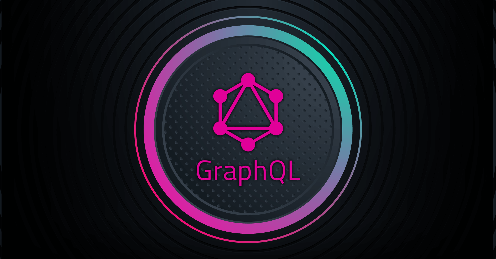

# GraphQL
- The GraphQL is a Query Language.
- Alternative to using a REST API.

### REST API vs GraphQL
#### REST API
- Over fetching > Getting back more data than we need.
- Under fetching > Getting back less data than we need. Then we have to request additional data using another API call.

#### GraphQL
- Single Endpoint > Getting all the data using single call.

### Run the project
```
nodemon index
```

### How to fetch single review?
#### Steps using example:
- Go to the Apollo Sandbox.
- In the **Operation** window type below;
```
query ExampleQuery($id: ID!) {
   game(id: $id) {
      id
      reviews {
        rating
        content
      }
   }
}
```
- If you want to fetch '1', you have to type below input in the **Variables** window;
```
{
   "id": "1"
}
```
- Then Run & Enjoy.

### How to delete single game using mutation? 
#### Steps using example:
- Go to the Apollo Sandbox.
- In the **Operation** window type below;
```
mutation DeleteMutation($id: ID!) {
   deleteGame(id: $id) {
      id
      title
      platform
   }
}
```
- If you want to delete '2', you have to type below input in the **Variables** window;
```
{
   "id": "2"
}
```
- Then Run & Enjoy.

### How to add single game using mutation?
#### Steps using example:
- Go to the Apollo Sandbox,
- In the **Operation** window type below;
```
mutation AddMutation($game: AddGameInput!) {
   addGame(game: $game) {
      id
      title
      platform
   }
}
```
- If you want to add new game, you have to type below input in the **Variables** window;
```
{
   "game": {
      "title": "A new game",
      "platform": ["Switch", "PS5"]
   }
}
```
- Then Run & Enjoy.

### How to edit single game using mutation?
#### Steps using example:
- Go to the Apollo Sandbox.
- In the **Operation** window type below;
```
mutation EditMutation($id: ID!, $edits: EditGameInput!) {
   updateGame(id: $id, edits: $edits) {
      title
      platform
   }
}
```
If you want to update existing game, you have to type below input in the **Variables** window;
```
{
   "id": "2",
   "edits": {
      "title":"Lord of the Ring"
   }
}
```
Then Run & Enjoy.
